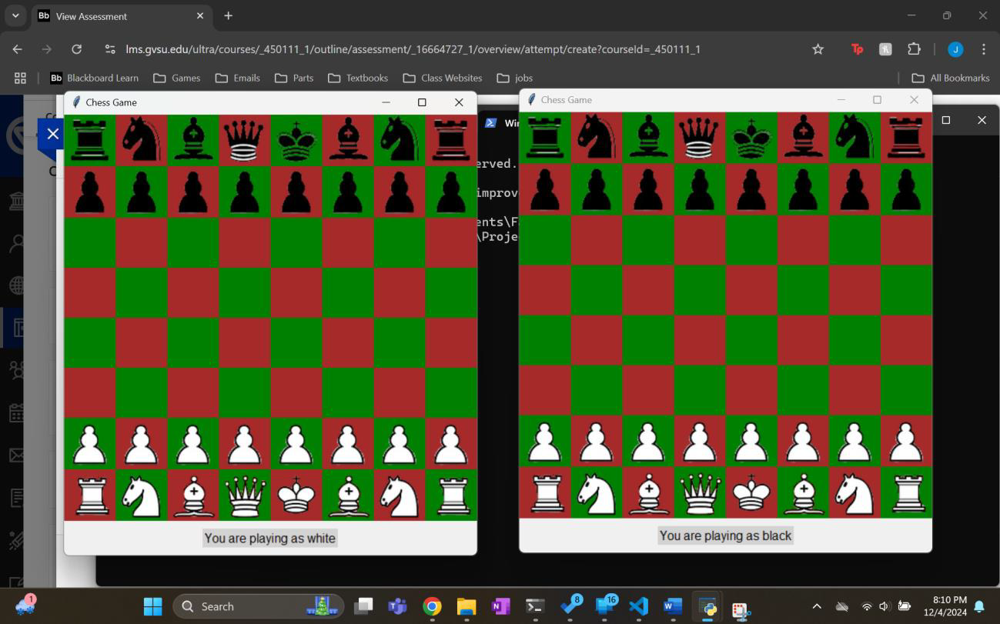
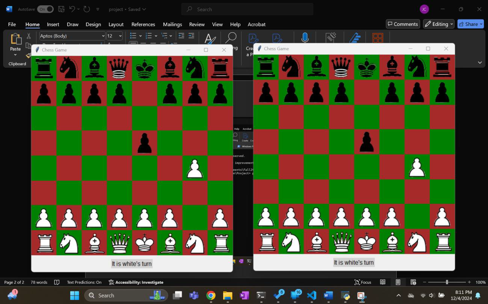
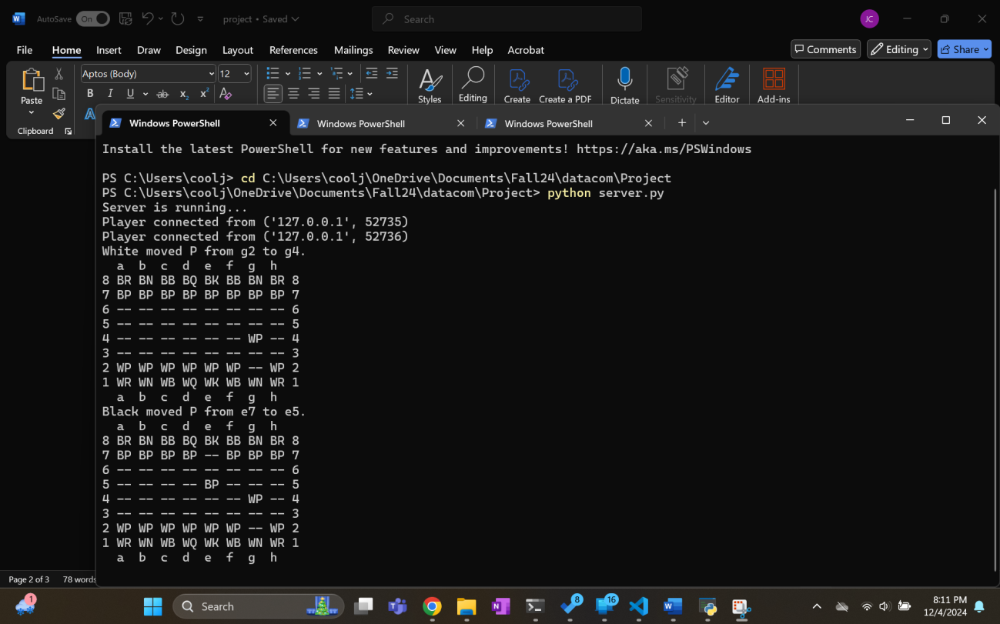
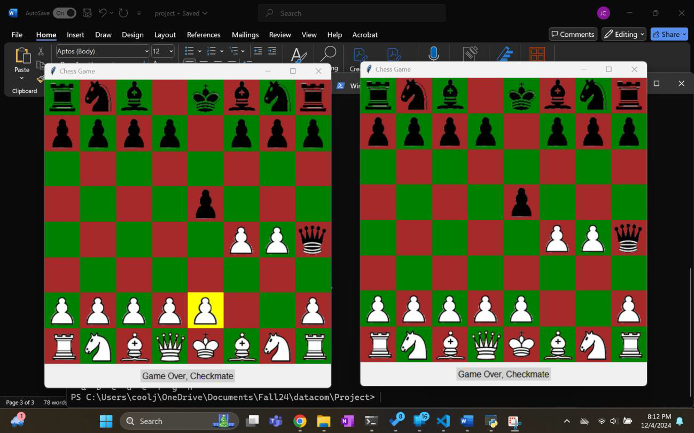

# 🧠 Socket-Based Chess Game

A networked chess game implemented using Python's socket programming and the client-server model. The game supports two players and includes a graphical interface built with Tkinter, along with backend logic for move validation, check, and checkmate detection.

## 📝 Project Description

This project demonstrates real-time communication between a server and two clients over TCP sockets. It includes:

- A **backend** module that implements the game logic and rules.
- A **server** that handles two-player matchmaking and move broadcasting.
- A **client** application with a full GUI interface using Tkinter and PIL for image rendering.

## 🖼️ Demo Screenshots

## 📁 File Structure

- backend.py - Core chess logic (pieces, movement rules board state)
- server.py - Handles client connections and game state synchronization
- client.py - GUI-based client that connects to server and plays the game
- images/ - Folder containing chess piece images

## 🔧 Technologies Used

- Python 3
- Tkinter (GUI)
- Python Imaging Library (Pillow)
- Socket Programming
- Threading

## 💻 How to Run

Start the server in a terminal
<pre> python server.py </pre>

Connect each client in two seperate terminals

<pre> python client.py</pre>

## 🎮 Features

- Full 8x8 chess board with images
- Mouse-based piece selection and movement
- Real-time move updates for both players
- Turn tracking and check/checkmate detection
- Invalid move feedback

## 📦 Limitations / Future Improvements

- Need to improve game logic
- Need to improve feedback to users
- No support for advanced rules (castling, en passant, promotion)
- No move history or undo functionality
- No reconnection support